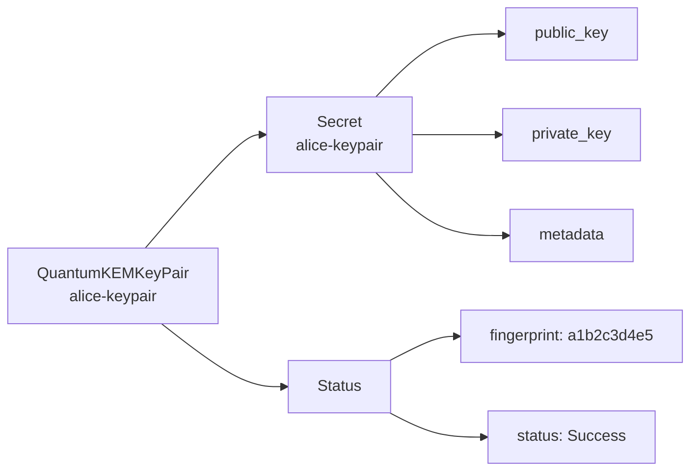
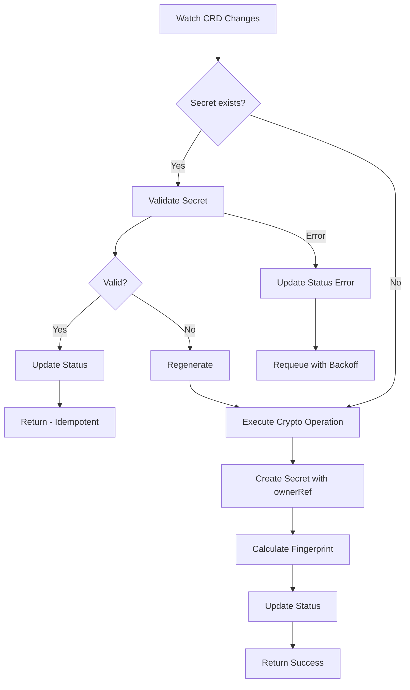
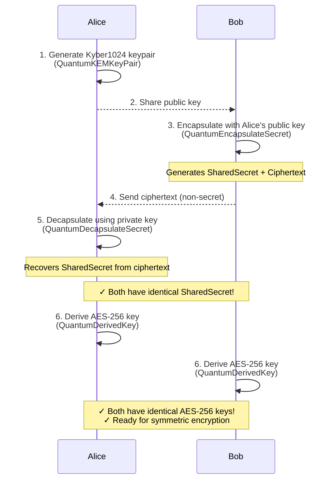
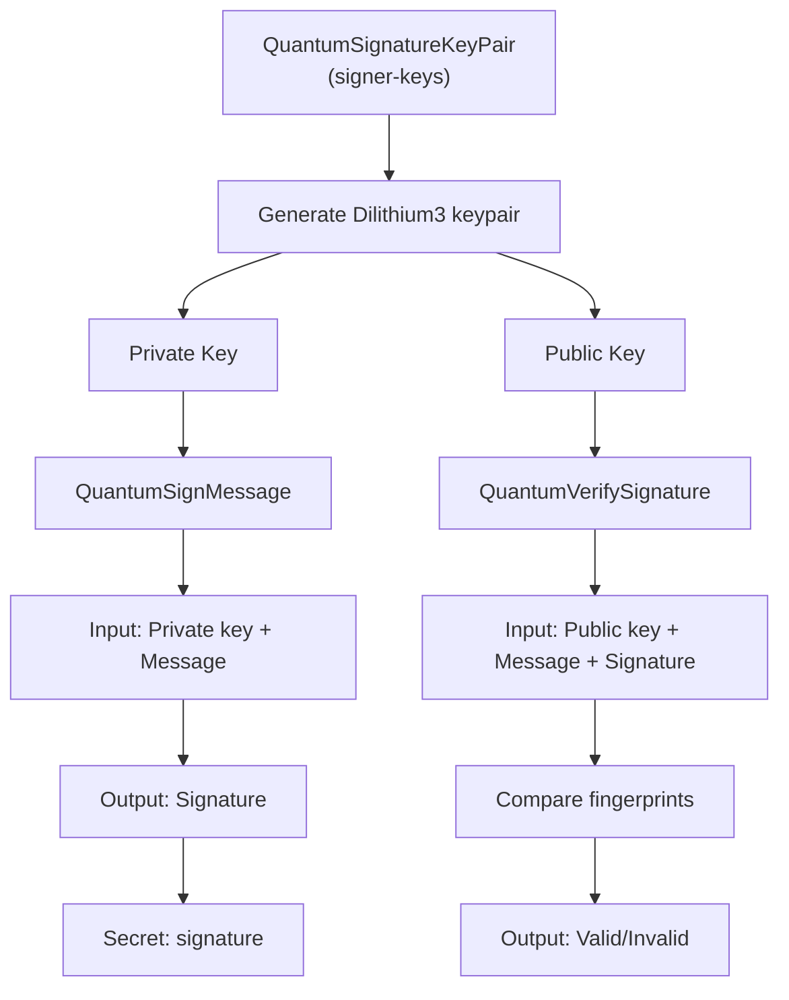
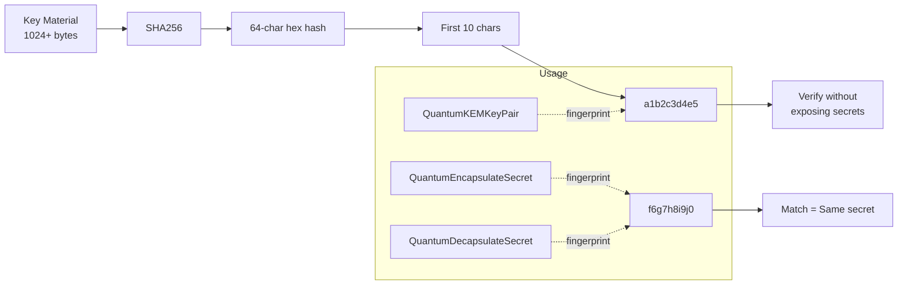
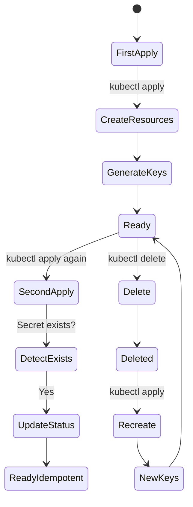
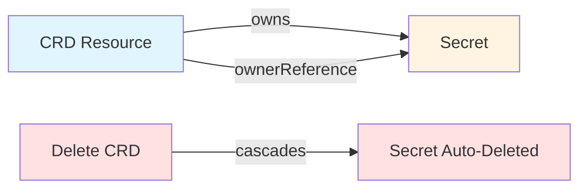
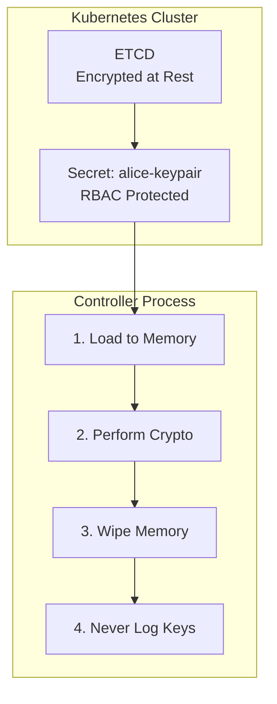
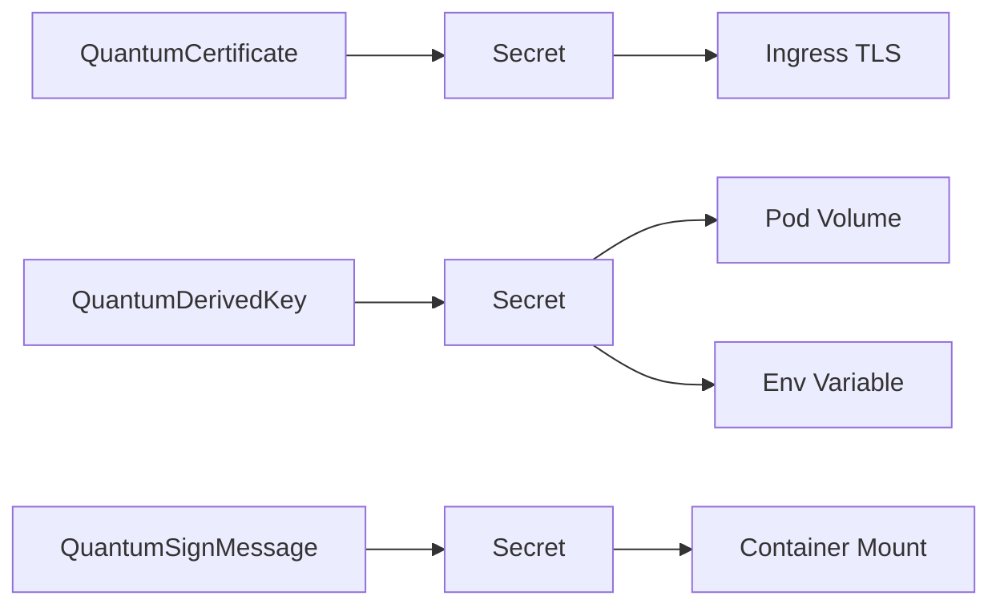
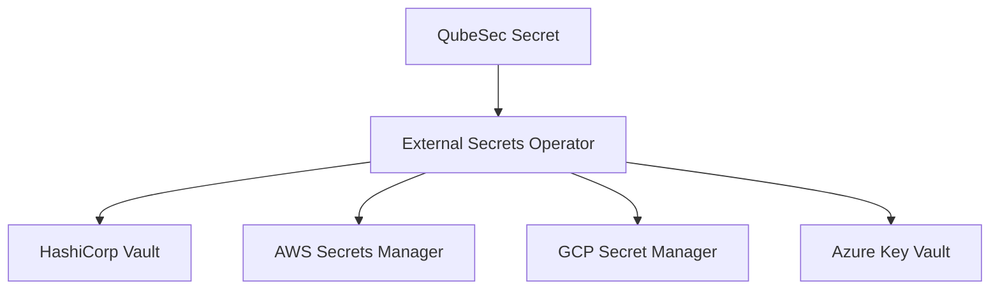

## System Overview

QubeSec is a Kubernetes operator that provides post-quantum cryptography through native custom resources (CRDs). The system architecture follows the standard Kubernetes operator pattern with reconciliation loops, status management, and owned resource cleanup.

---

## Core Components

### 1. CRDs (Custom Resource Definitions)

QubeSec defines 9 custom resources covering the complete cryptographic lifecycle:

| Resource | Purpose | Output |
|----------|---------|--------|
| **QuantumRandomNumber** | Generate random bytes | Random data Secret |
| **QuantumKEMKeyPair** | Generate Kyber keypairs | Public/private key Secret |
| **QuantumEncapsulateSecret** | KEM encapsulation | Shared secret + ciphertext |
| **QuantumDecapsulateSecret** | KEM decapsulation | Recovered shared secret |
| **QuantumDerivedKey** | HKDF key derivation | AES-256 key Secret |
| **QuantumSignatureKeyPair** | Generate signature keypairs | Public/private key Secret |
| **QuantumSignMessage** | Sign messages | Signature Secret |
| **QuantumVerifySignature** | Verify signatures | Verification result in status |
| **QuantumCertificate** | Generate X.509 certs | Certificate Secret |

### 2. Controllers

Each CRD has an associated controller that:
- **Watches** resource changes
- **Reconciles** by executing cryptographic operations
- **Stores** results in Kubernetes Secrets
- **Updates** status with results and fingerprints
- **Manages** owner references for garbage collection

### 3. Supporting Infrastructure

- **Webhooks**: Validate resource specifications
- **RBAC**: Service accounts with appropriate permissions
- **Secrets**: Store all cryptographic material
- **ConfigMaps**: Optional logging and configuration

---

## Data Storage Model

All cryptographic material is stored in Kubernetes Secrets in raw binary format:



### Secret Structure

Each cryptographic operation stores its output in a Secret:

```yaml
apiVersion: v1
kind: Secret
metadata:
  name: alice-keypair
  ownerReferences:
  - kind: QuantumKEMKeyPair
    name: alice-keypair  # Garbage collected when parent deleted
type: Opaque
data:
  public_key: <base64>
  private_key: <base64>
  metadata: <json>
```

---

## Reconciliation Flow

### Controller Reconciliation Pattern



---

## Key Exchange Data Flow

### Complete Quantum-Safe Key Exchange



---

## Signature and Verification Flow



---

## Fingerprinting Strategy

Fingerprints provide cryptographic commitments without exposing full key material:



**Benefits:**
- ✅ Verify without exposing secrets
- ✅ Audit logs contain readable 10-char strings
- ✅ Safe to include in logs, configs, CI/CD
- ✅ Cross-resource validation

---

## Idempotency and Reconciliation

Controllers implement idempotency to ensure safe reapplication:



---

## Resource Ownership and Garbage Collection

Resources use Kubernetes ownership references to clean up automatically:



---

## Security Architecture

### Key Material Protection



### Access Control

**RBAC Configuration:**
- Signing keys restricted to authorized service accounts
- Cross-namespace access requires explicit RBAC grants
- Network policies enforce namespace isolation

**Audit & Monitoring:**
- All Secret access logged via Kubernetes audit logs
- Resource creation/deletion events tracked
- Fingerprints in logs (safe for audit trails)

---

## Scalability Considerations

### Horizontal Scaling

- Multiple controller replicas with leader election
- Stateless reconciliation (state in ETCD)
- Efficient resource watching and caching

### Performance

- Kyber key exchange: microseconds
- Dilithium signing: milliseconds
- Parallel reconciliation of independent resources
- Minimal API server load with careful watches

---

## Integration Points

### With Kubernetes Native Resources



### With External Systems



---

## Future Architecture Enhancements

- **HSM Integration**: Support hardware security modules for key storage
- **Certificate Chains**: Parent CA references for CA hierarchies
- **Key Rotation Policies**: Automatic key rotation scheduling
- **Attestation**: Signed attestations for resource authenticity
- **Multi-tenant Isolation**: Enhanced RBAC for shared clusters
- **Hybrid Crypto**: Classical + post-quantum combined certificates

---

## See Also

- [Introduction](/)
- [Key Exchange Guide](/keyexchange)
- [Quantum Digital Signatures](/signatures)
- [Post-Quantum Certificates](/certificates)
- [Quick Start & Examples](/quickstart)
